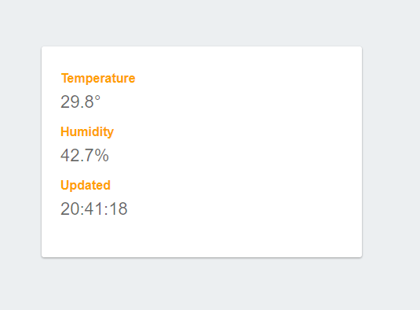

# Temperature And Humidity sensor using DHT22 and Firebase

This project uses NodeMCU(ESP8266) to read a DHT22 sensor and publish readings to google cloud functions, after that
it enter in sleep mode to save batery.

The cloud function stores in Firebase Realtime database and then is displayed on main page of project.

# Preview

